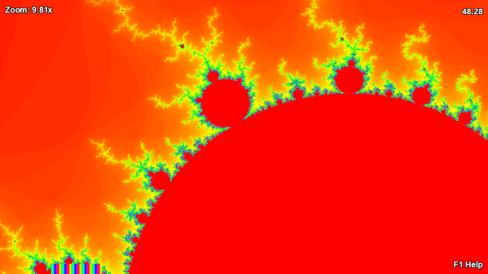
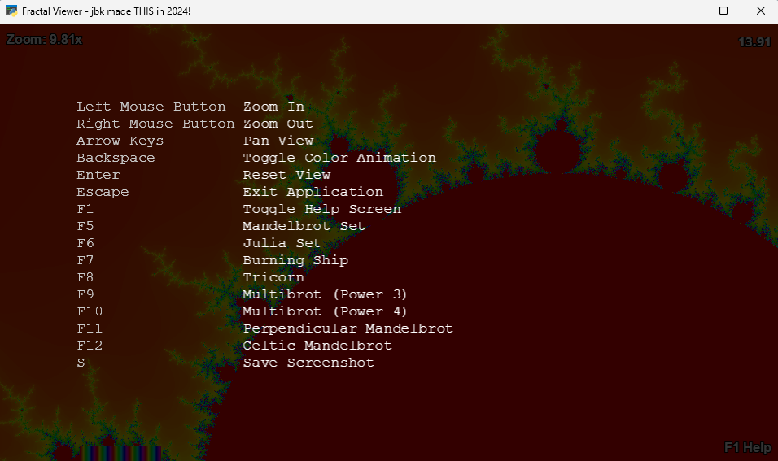

# FractalZoom

FractalZoom is an interactive fractal viewer built using Python, Pyglet, and OpenGL. Explore a variety of fractal sets in real time with smooth zooming, panning, dynamic color animations, and easy screenshot saving. The application leverages custom GLSL shaders for fast, real-time fractal rendering.

## Screenshots

Here are some examples of FractalZoom in action:


*FractalZoom displaying the Mandelbrot set.*


*Help screen.*

## Features

- **Interactive Fractal Exploration**
  - Render multiple fractal sets including:
    - Mandelbrot Set
    - Julia Set
    - Burning Ship Fractal
    - Tricorn Fractal
    - Multibrot (Power 3)
    - Multibrot (Power 4)
    - Perpendicular Mandelbrot
    - Celtic Mandelbrot

- **Shader-Based Rendering**
  - Utilizes custom GLSL shaders to perform fractal calculations directly on the GPU for high performance and smooth rendering.

- **Zoom and Pan**
  - **Zoom In:** Left Mouse Button
  - **Zoom Out:** Right Mouse Button
  - **Pan:** Arrow keys

- **Dynamic Color Animation**
  - Toggle color animation with the **Backspace** key

- **View Reset and Exit**
  - **Reset View:** Press **Enter**
  - **Exit Application:** Press **Escape** (with exit confirmation)

- **Screenshot Saving**
  - Press **S** to open a Save File dialog and choose a location and filename (with default `.png` extension) to save the current view as an image.

- **Help Overlay and Key Bindings**
  - **Toggle Help Overlay:** Press **F1**
  - **Hover Hint:** When you hover over the "F1 Help" label in the bottom-right corner, a hint box appears listing all key bindings in a neat, multi-line format.

## Requirements

- Python 3.12 or higher
- [Pyglet](https://pyglet.readthedocs.io/)
- [NumPy](https://numpy.org/)
- Tkinter (usually included with standard Python installations)

## Installation

1. **Clone the Repository:**

   ```bash
   git clone https://github.com/yourusername/FractalZoom.git
   cd FractalZoom
